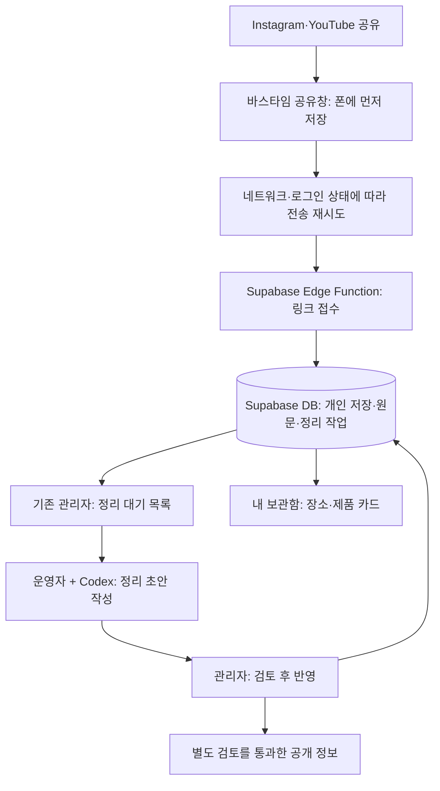

# 바스타임 저장·아카이브 전환 개발계획

작성일: 2026-09-22. 상태: 개발 착수용 제안. DB 변경·배포·요금제 가입은 아직 하지 않았습니다.

## 1. 이번에 만들 제품

**목욕 관련 게시물을 공유하면 바로 보관하고, 장소·제품별로 정리해서 다시 찾는 앱.**

사용자 결정은 **기존 바스타임을 빠르게 새 모델로 전환**하는 것입니다. 별도 비공개 베타를 길게 운영하는 계획 대신, 기존 앱에 핵심 흐름을 붙이고 실제 기기 검증 후 업데이트합니다. 소비자 화면은 모바일만 설계하며, [확정한 디자인 방향](../../02-design/bathtime-pivot-design-direction.md)을 따릅니다. 흰 바탕·민트/시안·Pretendard, 짧고 쉬운 한국어를 유지합니다.

첫 출시 목표는 다음 흐름이 실제 계정과 DB로 이어지는 것입니다.

> Instagram·YouTube 등에서 공유 → 휴대폰에 즉시 저장 → 계정에 동기화 → 운영자가 정리·확인 → 내 보관함에서 장소·제품으로 다시 찾기 → 원문·지도·제품 페이지 열기

현재 시험한 Android를 먼저 완성하는 것을 일정 산정의 가정으로 둡니다. iOS 공유 확장은 별도 구현·실기기 검증이 필요하며, 기존 iOS 배포 여부부터 확인합니다.

## 2. 현재 있는 것과 연결할 것

아래는 저장소 코드 기준입니다. 운영 DB에 적용된 마이그레이션, 실제 이용자 수, 호스팅 요금제, 스토어 배포 상태는 이번 계획에서 조회하지 않았습니다.

| 영역 | 확인한 상태 | 이번에 할 일 |
| --- | --- | --- |
| 공유 APK | 별도 Java 테스트 앱. 링크를 폰에 저장하고 원래 화면으로 복귀 | 동일 동선을 기존 Expo 앱에 통합하고 서버 동기화 추가 |
| 카드 시안 | 실제 원문 3건으로 만든 정적 웹 화면. 검색·필터·상세 동작 | 모바일 앱 화면으로 옮기고 계정별 실데이터 연결 |
| 기존 앱 | Expo / React Native, Supabase Auth 연결 코드 | 로그인·앱 식별자 재사용. 공유 수신용 네이티브 모듈/설정 추가 |
| DB | `user_profiles`, `saved_items`, `submissions`, `archive_content` 등 마이그레이션 | 외부 링크 접수와 정리 작업용 데이터 추가 |
| 기존 저장 | `src/storage/savedContent.ts`의 현재 선택 경로는 Supabase `saved_items` | 기존 저장 유지. 별도로 남아 있는 로컬 저장 경로의 실제 사용 여부 확인 |
| 관리자 | Next.js 앱, 제보 목록·상태 변경, 콘텐츠 관리 코드 | 정리 대기 목록·결과 검토·반영 기능 추가 |
| 알림 | Expo 알림 의존성과 토큰·설정 테이블 마이그레이션 | 실제 발송 경로 점검 후 정리 완료 알림에 재사용 |

**공유 저장과 카드 조회는 각각 검증한 프로토타입입니다. 계정·접수·분석·배포까지 연결된 운영 제품은 아직 아닙니다.** 기존 관리자 제보 기능도 링크 분석 작업 관리에 바로 쓸 수 있는 상태는 아닙니다. 파일 기반 대체 저장소는 새 운영 경로에서 사용하지 않습니다.

## 3. DB는 필요하고, 별도 상시 서버는 당장 필요하지 않음

기존 **Supabase를 DB·로그인·작은 서버 기능의 기반으로 유지**하는 것을 권장합니다. 폰에서 직접 해도 되는 조회와 서버에서만 해야 하는 처리를 나눕니다.

| 구성 | 맡길 역할 |
| --- | --- |
| 휴대폰 | 공유 수신, 즉시 저장, 전송 대기, 화면 표시, 최근 보관함 캐시 |
| Supabase Auth·Postgres | 계정, 개인 저장, 원문, 장소·제품 연결, 정리 상태 |
| 작은 서버 함수 | 로그인 확인, 링크 검증·중복 처리, 접수와 작업 생성, 추후 DM 수신 |
| 기존 관리자 | 작업 선택, 정리 결과 가져오기, 수정·승인, 실패 재처리 |
| Codex | 운영자가 요청한 링크 묶음의 조사·정리 초안 작성 |

내 보관함 조회는 사용자 권한을 적용한 Supabase Data API를 사용하면 됩니다. 접수처럼 여러 레코드를 함께 만드는 작업은 짧은 서버 함수와 DB 트랜잭션으로 처리합니다. 앱에 관리자용 키를 넣지 않습니다. [Supabase의 데이터 접근·권한 안내](https://supabase.com/docs/guides/database/secure-data)

서버리스도 서버 기능입니다. 직접 VM을 켜두고 관리하지 않는다는 뜻입니다. 긴 분석을 공유 요청 안에서 기다리게 하지 않습니다. 작업은 DB에 먼저 남깁니다. Edge Function의 백그라운드 실행에도 시간·메모리 제한이 있으므로, 나중에 자동 분석을 붙여도 대기 작업과 재시도 기록은 필요합니다. [실행 제한](https://supabase.com/docs/guides/functions/limits), [백그라운드 작업](https://supabase.com/docs/guides/functions/background-tasks)

## 4. 첫 업데이트의 범위

### 출시할 기능

- 공유 → 짧은 저장 확인 → 원래 앱 복귀. 저장 시 폴더·태그 입력을 요구하지 않습니다.
- 비로그인도 폰에 저장. 계정 동기화·정리는 앱에서 로그인한 뒤 시작합니다. 공유 도중 로그인 화면으로 끌고 가지 않습니다.
- 내 보관함: 장소·제품 구분, 이름·지역·특징 검색, 정리 대기 중인 링크 확인.
- 카드 상세: 이름, 지역 또는 브랜드, 짧은 요약, 핵심 조건, 저장한 원문, 확인일, 외부 페이지 연결.
- 같은 장소의 게시물 합치기, 한 게시물의 여러 장소·제품 연결, 잘못 묶인 결과 수정.
- 링크 삭제, 간단한 오류 제보, 정리 불가 상태에서도 원문 열기.
- 운영자 정리 대기 목록, 결과 검토·반영, 최소 운영 지표.
- 기존 콘텐츠·저장 항목을 계속 열 수 있는 경로. 기존 저장을 새 장소 카드로 임의 변환하지 않습니다.

처음 진입한 빈 보관함에는 공유 방법과 ‘링크 붙여넣기’를 제공합니다. 로그인·공유 설정 때문에 첫 저장 자체를 못 해보는 상황을 줄입니다.

장소·제품을 모델에는 모두 포함하되, **제품 링크 실사례 5건 정도로 표시 항목을 먼저 검증**합니다. 현재 장소 3건만으로 제품까지 자동 분류가 검증됐다고 보지 않습니다. 목욕 팁처럼 둘 다 아닌 글은 원문 카드로 보관합니다.

### 후속 업데이트로 둘 기능

Instagram DM, 완전 자동 분석, 공개 탐색 화면, 지도 내장, 영상 임베드, 결제, 사용자 폴더, 추천 피드. 첫 업데이트는 외부 지도·상품 페이지 연결로 충분합니다. 공개 정보가 쌓일 구조는 처음부터 마련하되, 탐색 화면을 채우기 위한 대량 수집은 하지 않습니다.

## 5. 데이터 설계 방향

중요한 분리는 **게시물 / 장소·제품 / 누가 저장했는가**입니다. 원문 1개와 장소 1개를 같은 레코드로 취급하면, 모음 게시물과 같은 장소의 후속 게시물을 처리하기 어렵습니다.

아래 이름은 새 스키마의 초안이며, 첫 단계에서 확정합니다.

| 데이터 | 역할·필수 규칙 |
| --- | --- |
| `archive_sources` | 플랫폼, 콘텐츠 ID, 원문 URL, 접근 범위, 원문 시점, 출처별 정리 결과. 원문 정규화와 중복 기준 관리 |
| `archive_saves` | 사용자와 원문의 저장 관계. 사용자+원문 중복 방지. 정리 전에도 저장 가능. 본인만 조회·삭제 |
| `archive_entities` | 장소 또는 제품의 식별 정보와 검토한 공통 정보. 다른 지점·다른 제품 규격을 이름만 보고 합치지 않음 |
| `archive_source_entities` | 원문과 장소·제품의 다대다 연결. 게시물에서 추출한 근거와 연결 상태 유지 |
| `archive_jobs` | 원문 정리 작업, 상태, 시도 횟수, 담당자, 오류 사유, 처리 시간, 적용한 결과 버전 |

- 기존 `user_profiles`와 관리자 권한은 재사용합니다. 기존 `saved_items`는 발행 콘텐츠 등 이미 존재하는 대상의 북마크이므로, 아직 정체를 모르는 외부 링크를 억지로 넣지 않습니다.
- 기존 `archive_content`는 편집·발행 콘텐츠로 유지합니다. 기존 상품·온천 데이터와 새 장소·제품이 일치하면 기존 ID를 연결하되, 전체 카탈로그 이관을 첫 출시 조건으로 만들지 않습니다.
- 공개 원문의 동일 URL은 검토한 정리 결과를 재사용할 수 있습니다. 비공개·사용자별 접근 자료는 별도 접근 범위를 두고 공통 DB로 자동 합치지 않습니다.
- 공개용 공통 정보와 개인 저장·비공개 원문에서 얻은 정보는 조회 권한을 분리합니다. 여러 출처를 합칠 때 다른 사용자의 비공개 정보가 카드에 섞이지 않아야 합니다.
- DB에는 요금·시간의 값뿐 아니라 **출처 URL, 게시일/확인일, 공식 안내인지 게시물 경험인지**를 함께 둡니다. 정보가 없으면 비워둡니다.
- 관리자가 원문을 다른 장소에 다시 연결해도 사용자의 저장 관계는 유지합니다. 잘못 합친 장소를 나눌 수 있어야 합니다.
- 개인 저장·처리 상태는 기존 공개 `/api/content-snapshot`이나 공용 캐시에 넣지 않습니다.

## 6. 저장과 정리를 분리한 사용 흐름

1. 공유창은 링크를 로컬 저장소에 안전하게 기록한 뒤 닫습니다. 서버 응답이나 분석 완료를 기다리지 않습니다.
2. 계정이 연결돼 있으면 전송을 예약합니다. 네트워크 끊김·앱 종료에 대비해 전송 대기를 남기고, 앱 재실행 때도 복구합니다.
3. 서버는 인증된 사용자를 기준으로 원문·개인 저장·정리 작업을 한 번만 생성합니다. 재전송돼도 저장 수와 분석 작업이 중복되지 않습니다.
4. 관리자가 검토한 결과를 반영하면 해당 사용자의 보관함에서 카드가 완성됩니다. 첫 버전은 앱 진입·새로고침으로 갱신하고, 상시 실시간 연결은 붙이지 않습니다.
5. 분석 중 삭제한 저장은 완료 시 다시 나타나지 않습니다. 계정을 바꾸면 이전 계정의 전송 대기·캐시가 새 계정으로 넘어가지 않습니다.

Android에서는 **공유창이 닫혀도 전송이 이어지는지**를 기존 Expo 앱에서 먼저 검증합니다. 네이티브 전송 예약과 로그인 세션 연결이 필요한 부분입니다. OS 강제 종료·백그라운드 제한으로 즉시 전송되지 않을 때는 다음 실행에서 복구하며, 서버 접수 전에는 정리 중이라고 표시하지 않습니다.

| 실제 상태 | 사용자에게 보여줄 표현 예시 |
| --- | --- |
| 폰에만 기록됨 | 폰에 저장했어요 / 연결되면 보관함에 올릴게요 |
| 로그인 전 | 로그인하면 다른 기기에서도 볼 수 있어요 |
| 서버 접수 완료·대기 | 저장했어요 / 순서대로 정리하고 있어요 |
| 결과 반영 | 정리된 장소·제품 카드 표시 |
| 원문 접근 불가·내용 부족 | 링크는 보관했어요. 내용을 확인하지 못했어요 |

문구는 구현 상태에 맞춰 확정합니다. 폰 저장, 계정 저장, 정리 완료를 모두 같은 ‘완료’로 표시하지 않습니다.

## 7. 초반 운영: Codex로 정리하는 방법

관리자에서 **대기 목록 → 링크 묶음 내보내기 → Codex로 초안 작성 → 결과 가져오기 → 미리보기·수정 → 반영**까지 지원합니다. 계정 정보나 DM 대화 전체 대신 작업 ID·원문·필요한 공개 근거만 정리 입력으로 전달합니다.

결과 형식은 제목, 대상 후보, 요약, 항목별 근거, 확인일, 불확실한 점을 가진 JSON으로 고정합니다. 가져올 때 형식을 검증하고 관리자가 승인한 버전만 사용자에게 보여줍니다. 승인·수정 이력은 남기고 이전 버전으로 되돌릴 수 있게 합니다.

**Codex를 운영 보조 도구로 사용하는 방식이며, 현재 대화가 24시간 서버 작업자로 동작하는 구조는 아닙니다.** 작업 PC가 꺼져 있어도 접수는 DB에 남지만, 수동 정리는 운영자가 처리할 때 진행됩니다. 구독 사용량과 운영 시간은 비용에 포함해서 봅니다.

초기 운영안은 하루 1~2회 대기 목록 확인입니다. 신규 원문 1건에 드는 실제 시간과 실패율을 재서 하루 처리량·계정별 신규 정리 한도를 정합니다. 예를 들어 하루 30분을 쓸 수 있고 새 원문 1건이 평균 3분이라면 신규 정리는 약 10건/일입니다. 이는 계획용 예시이며 실제 처리속도 예측은 아닙니다.

처리량이 넘치면 링크 보관은 유지하고 신규 정리 접수 한도를 안내합니다. 접근 불가 원문은 무한 재시도하지 않고 사유를 남깁니다. 출시 전 측정한 대기 시간을 서비스 안내에 반영하며, 즉시 자동 정리를 약속하지 않습니다.

공개 DB 발행은 사용자에게 정리 결과를 돌려주는 것과 별도 단계입니다. 첫 버전에서도 장소·제품 식별과 공개 가능 여부를 기록해 자산은 쌓되, 원문 영상·사진·캡션을 그대로 재배포하지 않습니다. 사용 가능한 이미지가 없으면 텍스트 표지를 씁니다. 현재 시안의 원문 이미지가 상용 배포 가능한지는 별도로 확인합니다.

## 8. 개발 순서와 완료 기준

작업 순서는 기존 앱의 빠른 전환에 맞춥니다. 기간은 1인 개발의 거친 작업일 추정이며, 운영 DB 확인·네이티브 통합 결과로 조정합니다. 스토어 심사와 Meta 검토 대기 시간은 포함하지 않습니다.

| 순서 | 작업·산출물 | 다음 단계로 넘어갈 기준 | 예상 작업일 |
| --- | --- | --- | --- |
| 1 | 현행 DB·배포 상태 확인, 스키마·화면 정보 확정, 기존 앱에서 공유 수신·전송 실험 | 실제 장소·제품·모음·중복 사례를 모델로 표현. 기존 앱 패키지에서 공유·복귀 가능 | 1~2일 |
| 2 | 새 테이블·권한, 접수 함수, 로그인 연결, 로컬 전송 대기·재시도 | 폰에서 공유한 링크가 본인 계정과 관리자 대기 목록에 등장. 재시도해도 1건 | 3~4일 |
| 3 | 관리자 정리 작업 화면, JSON 가져오기·검토·반영 | 원문 → 초안 → 승인 → 본인 카드 조회를 수동 DB 편집 없이 수행 | 2~3일 |
| 4 | 현재 시안을 기존 앱에 적용, 장소·제품 보관함·상세·검색·상태·삭제 | 정리된 카드에서 원문·지도·제품 페이지를 실제로 다시 열기. 360~430px·접근성 점검 | 3~4일 |
| 5 | 기존 저장 유지, 계정·삭제 흐름, 백업·복구, 운영 지표, 실기기·업데이트 검증 | 아래 출시 확인 항목 통과 후 기존 앱 업데이트 | 2~3일 |
| 6 | 출시 후 실제 저장·재방문 관찰, 실패 원인 보완 | 저장한 것을 다시 찾는 행동과 운영 비용을 측정 | 출시 후 1~2주 관찰 |

**첫 업데이트까지 대략 11~16작업일을 계획 범위로 둡니다.** 단계 1에서 범위와 일정을 다시 추정합니다. 공유 통합·외부 원문 접근이 가장 큰 변수입니다. 날짜를 맞추려고 저장 안정성이나 개인정보 구분을 빼지 않고, 후속 기능을 미룹니다.

장소·제품 카드의 필수 정보는 ‘뭔지, 어디인지/어느 브랜드인지, 왜 저장했는지 떠올릴 특징, 원문으로 돌아갈 길’입니다. 모든 시설의 최신 요금·운영시간을 조사해 완성형 가이드로 만드는 것을 기본 작업량으로 잡지 않습니다.

## 9. 기존 앱 업데이트와 운영 확인

기존 Android 앱 식별자는 `com.bathtimestudio.bathtime`입니다. 테스트 APK는 별도 식별자이므로, 그 APK를 그대로 정식 업데이트 파일로 쓰지 않습니다. 기존 패키지·서명 체계를 유지해 새 버전으로 빌드합니다. 웹 카드 시안도 기존 앱에 맞게 이식합니다.

출시 전 필수 확인:

- 기존 사용자의 로그인·저장 항목이 업데이트 뒤에도 남고, 예전 콘텐츠를 열 수 있는지 확인.
- 운영 DB의 실제 스키마·RLS를 확인하고, 추가형 마이그레이션을 개발 환경에서 검증. 기존 테이블·공개 사이트 조회 경로는 유지.
- 본인 A와 다른 사용자 B, 로그아웃 상태로 조회·수정·삭제 권한 검증. 관리자 전용 작업과 공개 정보도 구분.
- 온라인/오프라인 공유, 로그인 전 저장, 앱 종료 후 재실행, 중복 공유, 로그인 만료, 계정 전환을 실제 기기에서 확인.
- 한 원문 여러 장소, 여러 원문 한 장소, 잘못된 장소 연결 수정, 정리 전 삭제를 확인.
- 링크 정규화·중복 처리·결과 가져오기·권한에는 의미 있는 자동 테스트를 추가. 관련 타입 검사·빌드·기존 저장 회귀 검증 수행.
- 외부 URL 처리 시 허용 플랫폼·URL 길이·요청 한도 적용. 서버가 URL을 읽는 경로는 내부 주소 접근과 과도한 리다이렉트·응답 크기를 제한.
- DB 백업과 복구 절차를 실제로 확인. 장애 시 접수/정리 일시중지와 기존 보관함 조회 유지, 앱 수정 버전 재배포 경로 준비.
- 계정 탈퇴·저장 삭제·오류 신고·문의 경로 확인. 원문 수집·운영자 검토·공개 정보의 범위를 개인정보 안내에 반영.
- 기존 앱의 짧은 업데이트 검증 후 배포. 별도 베타 서비스 운영을 필수 단계로 두지 않음.

운영자는 매일 미처리 건수·가장 오래된 대기·실패 사유·잘못 합쳐진 대상·오류 제보를 봅니다. 매주 저장 후 재방문, 카드 상세 열람, 원문/지도/제품 페이지 이동과 건당 정리 시간을 확인합니다. 로그에는 토큰·DM 전문·개인 URL의 민감한 매개변수를 남기지 않습니다.

## 10. 비용과 자동화 전환 기준

2026-09-22 공식 가격표 기준, Supabase Free는 월 $0, Pro는 **월 $25부터**입니다. Free는 비활동 시 일시중지와 자동 백업 부재가 있어 개발 검증에 적합하고, 실제 사용자 저장을 맡기는 공개 운영에는 Pro를 기본 예산 후보로 둡니다. 기존 유료 프로젝트를 재사용할 수 있는지 먼저 확인합니다. 추가 프로젝트·초과 사용량·세금·기존 호스팅/도메인 비용은 별도입니다. [Supabase 가격표](https://supabase.com/pricing)

| 비용 | 첫 운영안 |
| --- | --- |
| DB·인증·함수 | 기존 Supabase 프로젝트/요금 확인 후 포함량 안에서 시작 |
| 관리자·기존 웹 호스팅 | 현재 배포·요금제 재사용 가능 여부 확인. 새 호스팅 업체 추가는 보류 |
| 분석 | 별도 모델 API를 호출하지 않는 수동 운영으로 시작. Codex 구독 한도와 운영자 시간은 별도 비용 |
| 사진·영상 | 영상 파일을 저장하지 않음. 공개 사용 가능한 썸네일만 최소 보관 |
| 지도 | 외부 지도 검색 링크로 시작. 유료 Places API를 첫 출시 의존성으로 두지 않음 |

현재 3건은 조사·개발·디자인 작업이 섞인 대화여서 ‘원문 1건의 분석 비용’으로 환산하지 않습니다. 신규 원문 20~30건을 별도 작업으로 처리하며 정리 시간, 접근 성공률, 수정률, 중복 재사용률을 측정합니다.

다음 중 하나가 반복되면 API 자동화를 검토합니다: 수동 처리에 하루 30~60분 이상이 들거나, 약속한 대기 시간을 반복해서 넘기거나, 유료로 빠른 정리를 원하는 사용자가 확인될 때. 이는 초기 운영 판단 기준이며 시장 검증 결과가 아닙니다.

자동화는 DB의 같은 작업 목록에 분석 작업자를 붙여 시작합니다. 쉬운 원문부터 자동 초안으로 만들고 불확실한 건만 검토합니다. 작업 재시도·중복 반영 방지·실패 종료를 유지합니다. 영상 처리나 장시간 작업이 실제로 필요해지고 서버리스 제한을 넘을 때 별도 작업 서버를 검토합니다.

과금은 단순히 카드 수를 세기보다 **신규 정리 요청의 비용과 대기 시간**을 기준으로 검증합니다. 이미 정리한 공개 원문의 재사용과 원문 보관·조회는 신규 분석과 구분해 측정합니다. 첫 업데이트에 결제 기능을 넣지는 않습니다.

## 11. Instagram DM은 다음 입력 경로

핵심 접수·보관함이 안정되면 DM도 같은 접수 경로로 연결합니다. 앱에서 생성한 일회용 연결 코드를 DM으로 보내 계정을 연결하는 방식을 우선 실험합니다. 사용자명만 입력받아 소유자로 간주하지 않습니다.

검증할 내용:

1. 운영 계정과 Meta 앱에서 필요한 계정 유형·권한·심사 조건을 확인.
2. 실제 공유한 릴스·게시물의 수신 이벤트로 원문 식별이 가능한지, 내용까지 읽을 수 있는지 확인.
3. 메시지 서명·중복 수신 검증, 만료되는 일회용 코드, 계정 연결 해제 구현.
4. 접수 응답과 정리 완료 응답에 적용되는 발송 가능 시간·정책 확인. 완료 DM을 보낼 수 없으면 앱 보관함에서 결과 확인.
5. 테스트 역할이 아닌 일반 사용자 계정으로도 수신·연결·결과 전달 검증 후 공개.

공유 URL을 받는 것과 영상·캡션 내용을 안정적으로 가져오는 것은 별개의 문제입니다. 현재 브라우저에서 원문 3건을 읽었다고 해서 API 수집까지 검증된 것은 아닙니다.

이번 조사에서 [Meta Instagram Messaging 공식 문서](https://developers.facebook.com/docs/instagram-platform/instagram-api-with-instagram-login/messaging-api/)는 요청 제한으로 본문을 확인하지 못했습니다. 따라서 정확한 권한·발송 시간·지원 범위는 미확정 항목으로 남기며, DM을 첫 업데이트의 출시 조건으로 두지 않습니다.

## 12. 다음 작업의 구체적인 결과물

다음 개발 단위는 **‘기존 앱에서 공유한 링크가 계정별 정리 대기 목록에 쌓이는 것’**입니다.

결과물: 스키마·권한 마이그레이션, 접수 함수, 기존 앱의 공유 수신·전송 대기, 관리자 대기 목록, 실기기 확인 기록. 이 흐름이 확인되면 현재 카드 시안과 Codex 정리 결과를 연결합니다. 장기적인 공개 DB·DM·결제 설계가 이 첫 단계를 지연시키지 않게 합니다.
